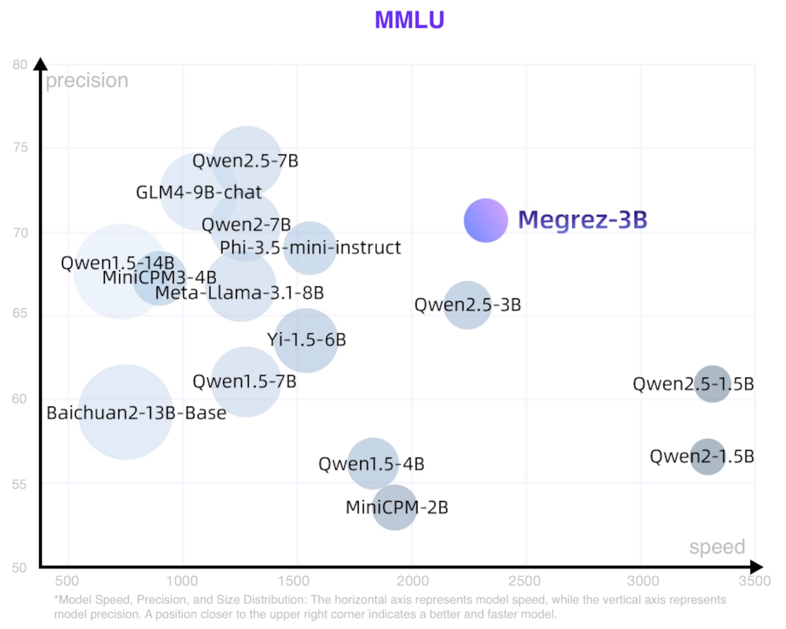
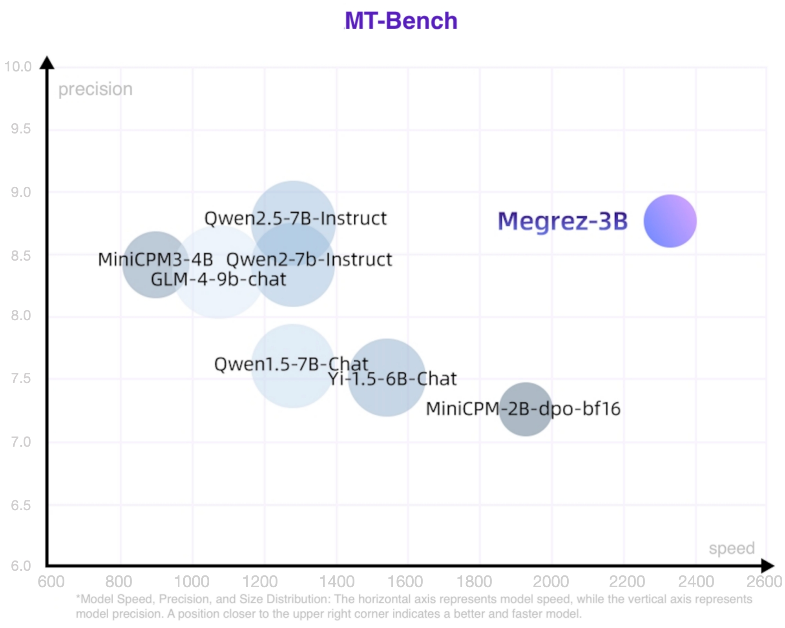

<h1 align="center">Megrez-3B: 软硬协同释放无穹端侧智能</h1>
<p align="center">
    
<p>
<p align="center">
        🤗 <a href="https://huggingface.co/Infinigence/Megrez-3B-Instruct">Megrez-3B-Instruct</a>&nbsp&nbsp| &nbsp&nbsp🤗 <a href="https://huggingface.co/Infinigence/Megrez-3B-Omni"> Megrez-3B-Omni</a>&nbsp&nbsp  &nbsp | &nbsp&nbsp📖 <a href="assets/wechat-official.jpg">WeChat Official</a>&nbsp&nbsp  |  &nbsp&nbsp💬 <a href="assets/wechat-group.jpg">WeChat Groups</a>&nbsp&nbsp
<h4 align="center">
    <p>
        <b>中文</b> | <a href="https://github.com/infinigence/Infini-Megrez/blob/main/README_EN.md">English</a>
    <p>
</h4>

# 目录

- [目录](#目录)
- [模型下载](#模型下载)
- [Megrez-3B-Omni](#megrez-3b-omni)
  - [评测结果](#评测结果)
    - [图片理解能力](#图片理解能力)
    - [速度](#速度)
  - [快速上手](#快速上手)
    - [在线体验](#在线体验)
    - [本地部署](#本地部署)
  - [注意事项](#注意事项)
- [Megrez-3B](#megrez-3b)
  - [WebSearch](#websearch)
- [开源协议及使用声明](#开源协议及使用声明)

# 模型下载

| HuggingFace                                                  | ModelScope                  |Modelers
| :-----------------------------------------------------------:|:---------------------------:|:--------:|
| [Megrez-3B-Instruct-Omni](https://huggingface.co/Infinigence/Megrez-3B-Omni) | [Megrez-3B-Instruct-Omni](https://www.modelscope.cn/models/InfiniAI/Megrez-3B-Omni) |[Megrez-3B-Instruct-Omni](https://modelers.cn/models/INFINIGENCE-AI/Megrez-3B-Omni)  |
| [Megrez-3B-Instruct](https://huggingface.co/Infinigence/Megrez-3B-Instruct) | [Megrez-3B-Instruct](https://www.modelscope.cn/models/InfiniAI/Megrez-3b-Instruct)|[Megrez-3B-Instruct](https://modelers.cn/models/INFINIGENCE-AI/Megrez-3B-Instruct)|

# Megrez-3B-Omni
Megrez-3B-Omni是由无问芯穹（[Infinigence AI](https://cloud.infini-ai.com/platform/ai)）研发的**端侧全模态**理解模型，基于无问大语言模型Megrez-3B-Instruct扩展，同时具备图片、文本、音频三种模态数据的理解分析能力，在三个方面均取得最优精度
- 在图像理解方面，基于SigLip-400M构建图像Token，在OpenCompass榜单上（综合8个主流多模态评测基准）平均得分66.2，超越LLaVA-NeXT-Yi-34B等更大参数规模的模型。Megrez-3B-Omni也是在MME、MMMU、OCRBench等测试集上目前精度最高的图像理解模型之一，在场景理解、OCR等方面具有良好表现。
- 在语言理解方面，Megrez-3B-Omni并未牺牲模型的文本处理能力，综合能力较单模态版本（Megrez-3B-Instruct）精度变化小于2%，保持在C-EVAL、MMLU (Pro）、AlignBench等多个测试集上的最优精度优势，依然取得超越上一代14B模型的能力表现
- 在语音理解方面，采用Qwen2-Audio/whisper-large-v3的Encoder作为语音输入，支持中英文语音输入及多轮对话，支持对输入图片的语音提问，根据语音指令直接响应文本，在多项基准任务上取得了领先的结果

## 评测结果
### 图片理解能力

- 上图为Megrez-3B-Omni与其他开源模型在图片理解各任务的能力比较；  
- 下图为Megrez-3B-Omni在opencompass测试集上表现，参考 [InternVL 2.5 Blog Post](https://internvl.github.io/blog/2024-12-05-InternVL-2.5/)


更多指标数据请见 🤗 [Megrez-3B-Omni](https://huggingface.co/Infinigence/Megrez-3B-Omni)

### 速度

|                | image_tokens | prefill (tokens/s) | decode (tokens/s) |
|:--------------:|:------------:|:------------------:|:-----------------:|
| Megrez-3B-Omni |      448     |       6312.66      |       **1294.9**      |
| Qwen2-VL-2B    |     1378     |       7349.39      |       685.66      |
| MiniCPM-V-2_6  |      448     |       2167.09      |       452.51      |

实验设置： 
- 测试环境：NVIDIA H100，vLLM下输入128个Text token和一张1480x720大小图片，输出128个token，num_seqs固定为8
- Qwen2-VL-2B虽然其具备更小尺寸的基座模型，但编码上述大小图片后的image_token相较Megrez-3B-Omni多很多，导致此实验下的decode速度小于Megrez-3B-Omni


## 快速上手

### 在线体验

[HF Chat Demo](https://huggingface.co/spaces/Infinigence/Megrez-3B-Omni)

### 本地部署

环境安装和vLLM推理代码等部署问题请参考 [Infini-Megrez-Omni](https://github.com/infinigence/Infini-Megrez-Omni)

如下是一个使用transformers进行推理的例子，通过在content字段中分别传入text、image和audio，可以图文/图音等多种模态和模型进行交互。
```python
import torch
from transformers import AutoModelForCausalLM

path = "{{PATH_TO_PRETRAINED_MODEL}}"  # Change this to the path of the model.

model = (
    AutoModelForCausalLM.from_pretrained(
        path,
        trust_remote_code=True,
        torch_dtype=torch.bfloat16,
        attn_implementation="flash_attention_2",
    )
    .eval()
    .cuda()
)

# Chat with text and image
messages = [
    {
        "role": "user",
        "content": {
            "text": "Please describe the content of the image.",
            "image": "./data/sample_image.jpg",
        },
    },
]

# Chat with audio and image
messages = [
    {
        "role": "user",
        "content": {
            "image": "./data/sample_image.jpg",
            "audio": "./data/sample_audio.m4a",
        },
    },
]

MAX_NEW_TOKENS = 100
response = model.chat(
    messages,
    sampling=False,
    max_new_tokens=MAX_NEW_TOKENS,
    temperature=0,
)
print(response)
```

## 注意事项
1. 请将图片尽量在首轮输入以保证推理效果，语音和文本无此限制，可以自由切换
2. 语音识别（ASR）场景下，只需要将content['text']修改为“将语音转化为文字。”
3. OCR场景下开启采样可能会引入语言模型幻觉导致的文字变化，可考虑关闭采样进行推理（sampling=False），但关闭采样可能引入模型复读

# Megrez-3B

Megrez-3B-Instruct是由无问芯穹（[Infinigence AI](https://cloud.infini-ai.com/platform/ai)）完全自主训练的大语言模型。Megrez-3B旨在通过软硬协同理念，打造一款极速推理、小巧精悍、极易上手的端侧智能解决方案。Megrez-3B具有以下优点：

- 高精度：Megrez-3B虽然参数规模只有3B，但通过提升数据质量，成功弥合模型能力代差，将上一代14B模型的能力成功压缩进3B大小的模型，在主流榜单上取得了优秀的性能表现。
- 高速度：模型小≠速度快。Megrez-3B通过软硬协同优化，确保了各结构参数与主流硬件高度适配，推理速度领先同精度模型最大300%。
- 简单易用：模型设计之初我们进行了激烈的讨论：应该在结构设计上留出更多软硬协同的空间（如ReLU、稀疏化、更精简的结构等），还是使用经典结构便于开发者直接用起来？我们选择了后者，即采用最原始的LLaMA结构，开发者无需任何修改便可将模型部署于各种平台，最小化二次开发复杂度。
- 丰富应用：我们提供了完整的WebSearch方案。我们对模型进行了针对性训练，使模型可以自动决策搜索调用时机，在搜索和对话中自动切换，并提供更好的总结效果。我们提供了完整的部署工程代码 [github](https://github.com/infinigence/InfiniWebSearch)，用户可以基于该功能构建属于自己的Kimi或Perplexity，克服小模型常见的幻觉问题和知识储备不足的局限。

速度精度模型大小散点图如下，位置越靠近右上表明模型越好越快。更多指标数据请见 🤗 [Megrez-3B-Instruct](https://huggingface.co/Infinigence/Megrez-3B-Instruct)




具体模型能力结果和部署代码参考 [Infini-Megrez](https://github.com/infinigence/Infini-Megrez/blob/main/megrez/README.md)

## WebSearch
我们模型进行了针对性训练，并提供了完整的工程部署方案。[InfiniWebSearch](https://github.com/infinigence/InfiniWebSearch) 具有以下优势：
1. 自动决定调用时机：自动决策搜索调用时机，在搜索和对话中自动切换，避免一直调用或一直不调用
2. 上下文理解：根据多轮对话生成合理的搜索query或处理搜索结果，更好的理解用户意图
3. 带参考信息的结构化输出：每个结论注明出处，便于查验
4. 一个模型两种用法：通过sys prompt区分WebSearch功能开启与否，兼顾LLM的高精度与WebSearch的用户体验，两种能力不乱窜

我们对模型进行了针对性训练，使模型可以自动决策搜索调用时机，在搜索和对话中自动切换，并提供更好的总结效果。我们提供了完整的部署工程代码 ，用户可以基于该功能构建属于自己的Kimi或Perplexity，克服小模型常见的幻觉问题和知识储备不足的局限。


# 开源协议及使用声明
- 协议：本仓库中代码依照 [Apache-2.0](https://www.apache.org/licenses/LICENSE-2.0) 协议开源。
- 幻觉：大模型天然存在幻觉问题，用户使用过程中请勿完全相信模型生成的内容。
- 价值观及安全性：本模型已尽全力确保训练过程中使用的数据的合规性，但由于数据的大体量及复杂性，仍有可能存在一些无法预见的问题。如果出现使用本开源模型而导致的任何问题，包括但不限于数据安全问题、公共舆论风险，或模型被误导、滥用、传播或不当利用所带来的任何风险和问题，我们将不承担任何责任。

