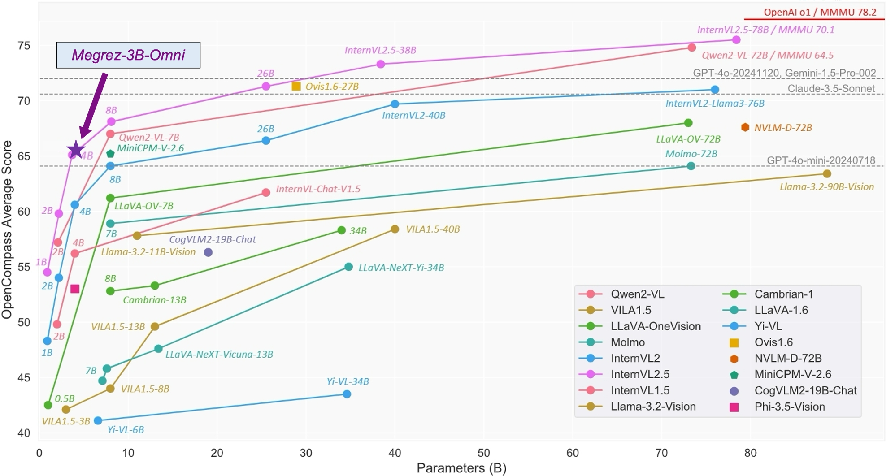

<h1 align="center">Megrez-3B: The integration of software and hardware unleashes the potential of edge intelligence</h1>

<p align="center">
    
<p>
<p align="center">
        🤗 <a href="https://huggingface.co/Infinigence/Megrez-3B-Instruct">Megrez-3B-Instruct</a>&nbsp&nbsp| &nbsp&nbsp🤗 <a href="https://huggingface.co/Infinigence/Megrez-3B-Omni"> Megrez-3B-Omni</a>&nbsp&nbsp  &nbsp | &nbsp&nbsp📖 <a href="assets/wechat-official.jpg">WeChat Official</a>&nbsp&nbsp  |  &nbsp&nbsp💬 <a href="assets/wechat-group.jpg">WeChat Groups</a>&nbsp&nbsp   
</p>
<h4 align="center">
    <p>
        <a  href="https://github.com/infinigence/Infini-Megrez/blob/main/README.md">中文</a> | <b>English</b>
    <p>
</h4>

# Quick Links

- [Model Downloads](#model-downloads)
- [Megrez-3B-Omni](#megrez-3b-omni)
  - [Evaluation Results](#evaluation-results)
    - [Image Understanding](#image-understanding)
    - [Inference Speed](#inference-speed)
  - [Qucikstart](#qucikstart)
    - [Online Experience](#online-experience)
    - [Local Deployment](#local-deployment)
    - [Notes](#notes)
- [Megrez-3B](#megrez-3b)
  - [WebSearch](#websearch)
- [Open Source License and Usage Statement](#open-source-license-and-usage-statement)

# Model Downloads
| HuggingFace                                                  | ModelScope                  |Modelers
| :-----------------------------------------------------------:|:---------------------------:|:--------:|
| [Megrez-3B-Instruct-Omni](https://huggingface.co/Infinigence/Megrez-3B-Omni) | [Megrez-3B-Instruct-Omni](https://www.modelscope.cn/models/InfiniAI/Megrez-3B-Omni) |[Megrez-3B-Instruct-Omni](https://modelers.cn/models/INFINIGENCE-AI/Megrez-3B-Omni)  |
| [Megrez-3B-Instruct](https://huggingface.co/Infinigence/Megrez-3B-Instruct) | [Megrez-3B-Instruct](https://www.modelscope.cn/models/InfiniAI/Megrez-3b-Instruct)|[Megrez-3B-Instruct](https://modelers.cn/models/INFINIGENCE-AI/Megrez-3B-Instruct)|


# Megrez-3B-Omni
**Megrez-3B-Omni** is an edge-side multimodal understanding model developed by **Infinigence AI** ([Infinigence AI](https://cloud.infini-ai.com/platform/ai)). It is an extension of the Megrez-3B-Instruct model and supports comprehensive understanding and analysis of image, text, and audio modalities. The model achieves state-of-the-art accuracy in all three domains:

- Image Understanding: By utilizing SigLip-400M for constructing image tokens, Megrez-3B-Omni outperforms models with more parameters such as LLaVA-NeXT-Yi-34B, in overall performance. It is one of the highest-accuracy image understanding models across multiple mainstream benchmarks, including MME, MMVet, OCRBench, and MMMU. It demonstrates excellent performance in tasks such as scene understanding and OCR.

- Language Understanding: Megrez-3B-Omni retains exceptional text understanding capabilities without significant trade-offs. Compared to its single-modal counterpart (Megrez-3B-Instruct), its overall accuracy variation is less than 2%, maintaining state-of-the-art performance on benchmarks like C-EVAL, MMLU (Pro), and AlignBench. It continues to outperform previous-generation models with 14B parameters.

- Speech Understanding: Equipped with the encoder head of Qwen2-Audio/whisper-large-v3, the model supports both Chinese and English speech input, multi-turn conversations, and voice-based questions about input images. It can directly respond to voice commands with text and has achieved leading results across multiple benchmark tasks.

## Evaluation Results
### Image Understanding


- The above image compares the performance of Megrez-3B-Omni with other open-source models on mainstream image multimodal tasks.
- The below image shows the performance of Megrez-3B-Omni on the OpenCompass test set. Image reference: [InternVL 2.5 Blog Post](https://internvl.github.io/blog/2024-12-05-InternVL-2.5/)




For more metric data, please refer to 🤗 [Megrez-3B-Omni](https://huggingface.co/Infinigence/Megrez-3B-Omni/blob/main/README_EN.md)

### Inference Speed

|                | image_tokens | prefill (tokens/s) | decode (tokens/s) |
|:----------------:|:------------:|:------------------:|:-----------------:|
| Megrez-3B-Omni |      448     |       6312.66      |       **1294.9**      |
| Qwen2-VL-2B    |     1378     |       7349.39      |       685.66      |
| MiniCPM-V-2_6  |      448     |       2167.09      |       452.51      |

Setup:  

- The testing environment utilizes an NVIDIA H100 GPU with VLLM. Each test includes 128 text tokens and a 720×1480 image as input, producing 128 output tokens, with `num_seqs` fixed at 8.  
- Under this setup, the decoding speed of **Qwen2-VL-2B** is slower than **Megrez-3B-Omni**, despite having a smaller base LLM. This is due to the larger number of image tokens generated when encoding images of the specified size, which impacts actual inference speed.  


## Qucikstart

### Online Experience

[HF Chat Demo](https://huggingface.co/spaces/Infinigence/Megrez-3B-Omni)(recommend) 

### Local Deployment

For environment installation and vLLM inference code deployment, refer to 🤗 [Infini-Megrez-Omni](https://github.com/infinigence/Infini-Megrez-Omni)

Below is an example of using transformers for inference. By passing text, image, and audio in the content field, you can interact with various modalities and models.
```python
import torch
from transformers import AutoModelForCausalLM

path = "{{PATH_TO_PRETRAINED_MODEL}}"  # Change this to the path of the model.

model = (
    AutoModelForCausalLM.from_pretrained(
        path,
        trust_remote_code=True,
        torch_dtype=torch.bfloat16,
        attn_implementation="flash_attention_2",
    )
    .eval()
    .cuda()
)

# Chat with text and image
messages = [
    {
        "role": "user",
        "content": {
            "text": "Please describe the content of the image.",
            "image": "./data/sample_image.jpg",
        },
    },
]

# Chat with audio and image
messages = [
    {
        "role": "user",
        "content": {
            "image": "./data/sample_image.jpg",
            "audio": "./data/sample_audio.m4a",
        },
    },
]

MAX_NEW_TOKENS = 100
response = model.chat(
    messages,
    sampling=False,
    max_new_tokens=MAX_NEW_TOKENS,
    temperature=0,
)
print(response)

```

## Notes
1. Please input the images in the first round to ensure inference effectiveness. There are no such restrictions for audio and text, which can be switched freely.
2. In the Automatic Speech Recognition (ASR) scenario, simply change content['text'] to "Convert speech to text."
3. In the OCR scenario, enabling sampling may introduce language model hallucinations that cause text changes. Consider disabling sampling for inference (sampling=False). However, disabling sampling may introduce model repetition.


# Megrez-3B

Megrez-3B is a large language model trained by Infinigence AI. Megrez-3B aims to provide a fast inference, compact, and powerful edge-side intelligent solution through software-hardware co-design. Megrez-3B has the following advantages:

- High Accuracy: Megrez-3B successfully compresses the capabilities of the previous 14 billion model into a 3 billion size, and achieves excellent performance on mainstream benchmarks.
- High Speed: A smaller model does not necessarily bring faster speed. Megrez-3B ensures a high degree of compatibility with mainstream hardware through software-hardware co-design, leading an inference speedup up to 300% compared to previous models of the same accuracy.
- Easy to Use: In the beginning, we had a debate about model design: should we design a unique but efficient model structure, or use a classic structure for ease of use? We chose the latter and adopt the most primitive LLaMA structure, which allows developers to deploy the model on various platforms without any modifications and minimize the complexity of future development.
- Rich Applications: We have provided a full stack WebSearch solution. Our model is functionally trained on web search tasks, enabling it to automatically determine the timing of search invocations and provide better summarization results. The complete deployment code is released on [github](https://github.com/infinigence/InfiniWebSearch).

The scatter plot of speed, accuracy and model size is roughly as follows. The point size represents the number of model parameters. For more metric data, please refer to 🤗 [Megrez-3B-Instruct](https://huggingface.co/Infinigence/Megrez-3B-Instruct/blob/main/README_EN.md)


The specific model capabilities and deployment code can be referenced. [Infini-Megrez](https://github.com/infinigence/Infini-Megrez/blob/main/megrez/README_EN.md)

## WebSearch
We have provided a fullstack WebSearch solution which has the following advantages:
1. Automatically determine the timing of search invocations: Switch between search and conversation automatically without tendency.
2. In-Context understanding: Generate reasonable search queries or process search results based on multi-turn conversations.
3. Structured output: Each conclusion is attributed to its source for easy verification.
4. One model with two usages: Enable the WebSearch ability by changing system prompt. Or you can use it as a classic LLM.

Our model is functionally trained on web search tasks. Users can build their own Kimi or Perplexity based on this feature, which overcomes the hallucination issues and gets update knowledge.


## Open Source License and Usage Statement

- **License**: The code in this repository is open-sourced under the [Apache-2.0](https://www.apache.org/licenses/LICENSE-2.0) license.  
- **Hallucination**: Large models inherently have hallucination issues. Users should not completely trust the content generated by the model. 
- **Values and Safety**: While we have made every effort to ensure compliance of the data used during training, the large volume and complexity of the data may still lead to unforeseen issues. We disclaim any liability for problems arising from the use of this open-source model, including but not limited to data security issues, public opinion risks, or risks and problems caused by misleading, misuse, propagation, or improper utilization of the model.  

